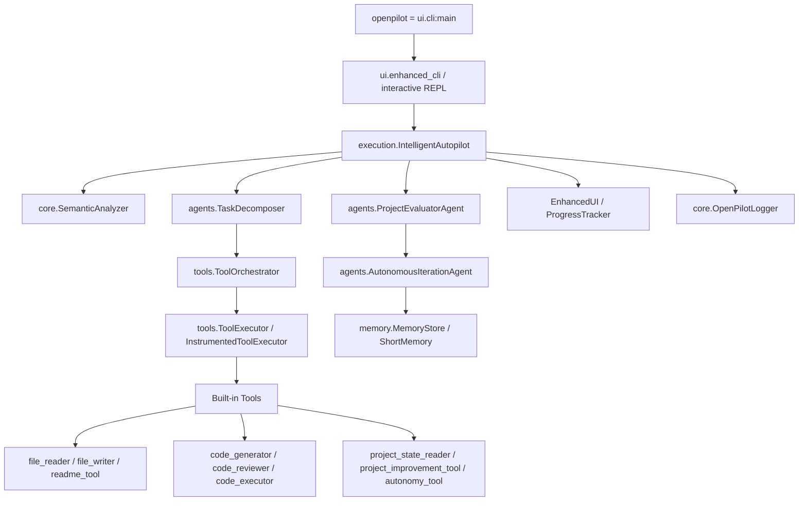

# OpenPilot 项目结构说明

## 目的与阅读方式

本文档用于重构前后的项目盘点，帮助快速理解当前 OpenPilot 的目录边界、关键文件职责和主要运行链路。它不是用户使用手册；用户安装和运行说明见 `README.md`。

当前代码已经收敛为现代 autopilot/agent/tool 架构。旧的 `planning/`、`validation/`、`autonomy/`、`reporting/`、`WorkflowExecutor` 和 `tests/` 已删除；后续重构建议可以写在本文末尾的占位区。

## 顶层目录

| 路径 | 主要职责 |
| --- | --- |
| `Code/src/` | OpenPilot 的 Python 包源码，包含 CLI、Agent、工具、模型、记忆、执行器、UI 和通用工具。 |
| `Code/data/` | 本地运行时数据，目前主要保留 memory 数据。 |
| `Code/logs/` | 运行时日志目录；日志 JSONL 是运行产物，可按需清理。 |
| `Code/README.md` | 安装、配置、使用方式和当前架构概览。 |
| `Code/PROJECT_STRUCTURE.md` | 当前结构说明和重构建议占位文档。 |
| `Code/pyproject.toml` | Python 包配置和 CLI entry point。当前命令入口为 `openpilot = ui.cli:main`。 |
| `Code/requirements.txt` | 依赖列表。 |
| `Code/.env.example` | LLM API、模型和运行参数的环境变量模板。 |

## `src` 模块职责

### `ui/`

负责命令行入口、交互式 REPL、Rich dashboard、进度追踪和通用询问界面。`cli.py` 只保留 `config` 与 `run/openpilot` 入口，`enhanced_cli.py` 负责现代交互模式和 `/autopilot` 调用链，`enhanced_ui.py` 与 `progress_tracker.py` 负责 Task Graph、Current Task Details、spinner 和 LLM/tool 公共进度 trace，`question_ui.py` 提供可复用的问题询问 UI。

### `execution/`

负责任务执行主流程和代码相关能力。`intelligent_autopilot.py` 是当前 autopilot 核心编排器，连接语义分析、任务分解、工具执行、README 生成和自主迭代。`code_generator.py`、`code_executor.py`、`code_reviewer.py` 提供代码生成、执行和审查能力的底层实现。

### `agents/`

负责 Agent 层的推理、分解、评估和迭代。`task_decomposer.py` 将目标拆成可执行任务，`orchestrator.py` 管理 Agent 执行上下文，`project_evaluator.py` 做项目级硬校验与改进评估，`iterative_improvement.py` 中的 `AutonomousIterationAgent` 负责“读取项目状态 -> 生成改进目标 -> 设计任务 -> 执行 -> 评估 -> 写入记忆”的自主迭代 pipeline。

### `tools/`

负责标准化工具定义、注册、选择、编排和执行。核心边界包括 `tool_registry.py`、`tool_orchestrator.py`、`tool_executor.py`、`tool_selector.py` 和 `builtin_tools.py`。内置工具包括文件读写、目录列举、多文件读取、LLM 总结、代码生成、代码审查、代码执行、命令执行、README 生成、项目状态读取、项目提升空间分析和 `autonomy_tool`。

### `models/`

集中定义跨模块传递的数据结构，主要使用 Pydantic 模型和枚举。`task_models.py` 描述任务、Agent、执行上下文和任务执行结果；`tool_models.py` 与 `tool_orchestration_models.py` 描述工具协议、工具选择和编排结果；`evaluation_models.py` 描述项目评估、自主迭代目标、任务和结果；`autonomy_models.py` 描述 autonomy tool 的决策输出。

### `core/`

提供系统底层能力和共享基础设施。`llm.py` 封装 LLM 请求/响应和客户端，`instrumented_llm.py` 将 LLM 调用接入进度追踪，`config.py` 读取运行配置，`openpilot_log.py` 写审计日志，`semantic_analyzer.py` 负责目标语义分类，`risk.py` 处理风险识别，`graph.py` 和 `embedding.py` 提供通用图结构与 embedding 能力。

### `memory/`

负责短期上下文、长期记忆、上下文压缩和 memory vault。`memory_store.py` 是结构化记忆读写入口，`short_memory.py` 管理会话短期记忆、Git 信息和上下文摘要，`context_compressor.py` 负责压缩长上下文，`memory_vault.py` 提供 vault 式记忆管理。

### `utils/`

提供跨模块通用工具函数和数据结构，包括缓存、JSONL 处理、文本截断和 ANSI 清理、并发/超时、diff、格式化、树形可视化等。该目录只放无 LLM、无 ToolDefinition 协议、低副作用的纯函数和通用能力；需要被 Agent 调用且有标准输入输出协议的能力应放在 `tools/`。

## 核心运行链路

典型 `/autopilot` 流程从 `ui.cli:main` 进入交互模式，再由 `enhanced_cli.py` 创建 `IntelligentAutopilot`。Autopilot 先做语义分析和任务分解，再通过工具编排器选择并执行内置工具；如果产物是项目或代码文件，会生成 README，并进入项目评估与自主迭代。增强 UI 通过 `EnhancedUI` 和 `ProgressTracker` 展示 Task Graph、当前任务细节、工具 spinner 和 LLM 公共进度 trace，同时 `OpenPilotLogger` 写入结构化日志。

## 已删除的旧结构

- `planning/`：旧 plan/clarifier/timeline 路径已删除，目标理解和任务分解由 `SemanticAnalyzer` 与 `TaskDecomposer` 承担。
- `validation/`：旧验证目录已删除，项目级硬校验和改进评估迁入 `agents/`。
- `autonomy/`：旧控制器目录已删除，自治决策迁移为标准工具 `autonomy_tool`。
- `reporting/`：旧 task/report 命令和报告目录已删除。
- `tests/`：旧测试目录已删除，后续如需测试体系应按新架构重新设计。

## 待填写：具体重构建议

> 这里预留给后续重构原则和具体建议。建议每条建议都写清楚问题、原则、风险和验收标准，避免只写“优化结构”这类不可执行描述。

| 模块 | 问题 | 重构原则 | 优先级 | 风险 | 验收标准 |
| --- | --- | --- | --- | --- | --- |
|  |  |  |  |  |  |
|  |  |  |  |  |  |
|  |  |  |  |  |  |
