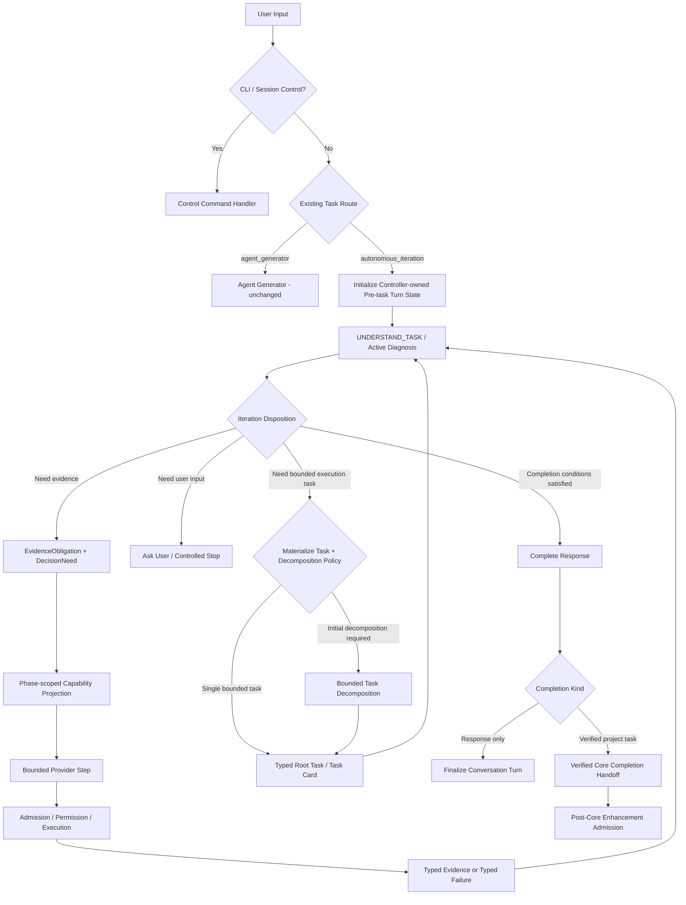

# OpenPilot 核心运行时可用性与主动迭代重构总体计划

> 状态：实施中；CRU-0、CRU-1 已完成；CRU-2A contract/store/assistant-ledger/
> task-materialization 切片已完成，下一切片为 Controller writer migration 与统一入口。
>
> 日期：2026-08-10
>
> 当前实施分支：`codex/user-error-tuning`
>
> 目标：先恢复 OpenPilot 作为本地开发 Agent 的基本可用性，再让所有已经进入 `autonomous_iteration` 的自然语言目标由同一个核心主动迭代控制层推进；该控制层可以在证据和完成条件已经满足时零工具、零分解地直接回答，也可以继续测量、行动、验证或停止。保留并强化现有问诊式 `DecisionNeed` 推进、权限、预算、验证、checkpoint 和 Provider 迁移边界。`agent_generator` 的入口、路由和实现本轮保持不变。

## 1. 文档定位

本计划处理当前用户端真实失败暴露出的核心运行时问题：

```text
用户输入“你用的是什么模型”
  -> task_classifier 默认 autonomous_iteration
  -> Semantic Analysis
  -> Memory Retrieval
  -> mandatory Task Decomposition
  -> provider 返回 kind=general
  -> 本地 validator 不接受 general
  -> 未处理异常和 traceback 暴露给用户
```

该失败不是一个孤立枚举错误，而是以下边界同时失效：

1. 普通问答无法在主动迭代内部合法地零步完成；
2. 未识别输入默认进入最重执行路径；
3. 初始任务分解对所有进入 `autonomous_iteration` 的目标强制执行；
4. Prompt schema 与本地 validator 存在双重事实源；
5. schema/semantic failure 位于 Provider fallback 之外；
6. 内部异常直接穿透 CLI；
7. 核心问诊式执行内核尚未成为所有执行任务的统一推进边界。

本计划不重新设计 post-core enhancement。该部分继续以另一工作树中的计划为权威：

```text
/Users/abab/Developer/openpilot-post-core-enhancement-plan/
docs/active_iteration/POST_CORE_ENHANCEMENT_OVERALL_PLAN.md
```

截至本计划冻结时，该分支位于 `codex/post-core-enhancement-plan` 的 `64d2757`，已经提交：

- Post-Core Enhancement 总体计划；
- Phase 0 inventory；
- repair、policy、completion、migration 等语义冻结。

两个计划的职责边界：

| 计划 | 负责内容 | 不负责内容 |
| --- | --- | --- |
| 本计划 | 用户输入、系统命令、主动迭代内直接完成、分解策略、问诊式核心推进、错误恢复、用户错误展示、core completion handoff | post-core 质量视角、opportunity admission、value gate、enhancement transaction |
| Post-Core Enhancement 计划 | verified core completion 后的质量覆盖、增强候选、单次受限事务、technical/value gate、rollback 和增强完成语义 | 普通问答、核心入口路由、核心任务执行方式 |

## 2. 设计基线

### 2.1 项目目标

OpenPilot 不是 Claude Code 的复刻。项目目标是构造一套：

- 面向小模型的外部认知脚手架；
- 模型尺度无关、Provider 可迁移的控制协议；
- 以 typed metadata 为主干；
- 以主动诊断、测量、行动和验证为推进方式；
- 可审计、可恢复、可预算、可证伪；
- 核心任务完成后可进入独立增强阶段的 Agent 系统。

本计划的范围限定为 `autonomous_iteration` 核心运行时。`agent_generator` 继续保持当前独立入口、路由、pipeline 和完成语义；本计划不把它改造成专家、工具、子任务或内部委派目标，也不修改知识工作到 `agent_generator` 的现有路由行为。该边界可以在未来单独评审，但不与当前用户可用性修复绑定。

### 2.2 问诊式主动迭代

本计划采用项目既有定义：

```text
目标与当前状态
  -> 识别已知、未知、冲突和风险
  -> 选择最有决策价值的下一项测量或行动
  -> 受控执行
  -> 吸收新鲜证据
  -> 重新判断下一步、恢复或停止
```

主动迭代不等于：

- 不受约束的自由工具循环；
- 为增加轮数而重复执行；
- 一次生成完整任务图后机械跑完；
- 由模型自由文本决定权限、完成或预算；
- 把 post-core enhancement 当作核心任务的额外重试。

### 2.3 应借鉴 Claude Code 的部分

Claude Code 源码提供的是运行机制参考：

- 普通文本可以直接完成；
- 只有真实 `tool_use` 才进入工具执行；
- 未知工具、参数错误和权限拒绝转换为 model-visible tool result；
- tool-use/tool-result 协议保持配对；
- Provider、上下文和输出长度错误具有显式、有界恢复；
- CLI 不因可恢复的模型协议错误崩溃。

这些机制只能作为 OpenPilot 的受控单步执行能力，不能取代主动诊断 Controller。

## 3. 当前架构事实

### 3.1 输入控制面

当前 interactive CLI 已经区分：

- CLI/System Commands：`/help`、`/config`、`/clear`、`/exit`；
- Session Constraint Commands：`/constraints`、`/confirm`、`/reject`、`/revoke`；
- shell-state 输入拦截；
- 自然语言 goal。

系统命令在任务路由前处理是正确边界。它们不应成为 `TaskRouteMetadata` 的新 route，也不应使用容易与 `command_executor` 混淆的 `local_command` 名称。

### 3.2 当前任务路由

`TaskRouteMetadata` 当前只允许：

```text
agent_generator
autonomous_iteration
```

分类器具有以下问题：

- 关键词承担控制权；
- 知识工作进入 `agent_generator`；
- 所有未识别输入默认进入 `autonomous_iteration`；
- 固定置信度没有校准意义；
- route reason 是诊断文本，却与控制决定一起由规则硬编码。

### 3.3 核心执行壳层

standard 和 enhanced UI 在新任务上都会执行：

```text
Semantic Analysis
  -> Memory Retrieval
  -> optional simple-code fast path
  -> mandatory Task Decomposition
  -> task execution
  -> result assembly
  -> optional/required post-core stage
```

这是一层固定 session pipeline。它不等于完整的主动迭代设计，但目前会在真正的问诊式子任务推进之前成为强制关卡。

### 3.4 问诊式核心内核

子任务执行已经拥有本计划需要保留的核心资产：

- `RuntimeStateMetadata.known_facts`；
- `unknowns` 与 `resolved_questions`；
- `DecisionNeedMetadata`；
- `ToolRouter` 和 typed Guard；
- phase-specific action；
- tool result absorption；
- no-progress detection；
- bounded replan/recovery；
- observed mutation 和 exact validation evidence；
- checkpoint、resume 和 indeterminate side-effect 边界。

本计划要修复的是：如何把正确的任务送入这一内核，以及如何让内核错误安全地回到下一次诊断，而不是替换它。

### 3.5 Post-core 边界

当前核心 subtasks 完成后，runtime 根据 `ProjectImprovementPolicy` 决定是否进入 post-core stage。

必须继续区分：

```text
core_success
improvement_status
overall_success
```

本计划只负责产生可靠的 verified core completion handoff。后续 enhancement 的 coverage、opportunity、slice、technical/value gate 由独立计划处理。

## 4. 目标总体架构



## 5. 权威边界

### 5.1 Core Active Iteration Entry

除 CLI/session control command 和现有 `agent_generator` route 外，所有进入 `autonomous_iteration` 的自然语言输入进入同一个核心主动迭代 Controller。Controller 先初始化一个 **controller-owned pre-task turn state**，而不是直接创建现有 task-owned `RuntimeStateMetadata`。

Pre-task state 只负责：

- 当前 conversation/run/turn identity；
- 用户输入和 bounded session projection；
- 当前 authority state；
- completion/evidence obligations；
- iteration disposition、decision budget 和 progress signature；
- response candidate 或 task-materialization 决策。

它不拥有 project task success、Project Improvement policy、mutation receipt 或 task checkpoint。只有当需要工具证据、形成 single task 或执行 decomposition 时，Controller 才原子 materialize task-owned `RuntimeStateMetadata`，并显式绑定 task ID、READ_ONLY/MUTATION authority、budget、policy 和 checkpoint lifecycle。

入口不强制：

- memory retrieval；
- task graph；
- project inspection；
- tool exposure；
- mutation authority；
- post-core stage。

`UNDERSTAND_TASK` 阶段根据已有事实和未决问题产生一个 typed iteration disposition：

```text
complete_response
ask_user
raise_decision_need
form_single_task
decompose_task
controlled_stop
```

这些是主动迭代内部的状态转换，不是互斥的公共入口 route。模型可以提出候选 disposition，但 Runtime Controller 拥有最终转换权。

### 5.2 Core Active Diagnostic Controller

是核心任务推进的最高控制者，负责：

- 当前 phase；
- 已知、未知和残余问题；
- 下一项 DecisionNeed；
- 测量、行动、恢复或停止；
- budget、no-progress 和 replan；
- core acceptance；
- verified core completion handoff。

模型可以提出行动，但不能拥有上述控制事实。

直接回答也使用同一个完成权：当本轮不再存在必须补充的 evidence obligation、用户没有请求副作用、回答可以由当前会话/运行时事实/稳定知识支持，并且 grounding gate 通过时，Controller 可从 `UNDERSTAND_TASK` 直接进入完成。复杂任务在多轮工具结果和验证之后也通过同一个完成门停止。

为避免把普通会话完成、等待用户和终止停止混在一个字段中，必须区分两个正交事实：

```text
outcome:
  completed
  awaiting_user
  blocked
  failed
  interrupted
  cancelled

completion_scope（仅 outcome=completed 时存在）:
  response_only
  project_task
```

预算耗尽、权限拒绝、no-progress、indeterminate side effect 等使用既有或新增的 typed stop/recovery reason，不能伪装成 completion scope。只有 `completion_scope=project_task`、`core_success=True`、verified-ready 且 post-core eligible 时才允许进入 post-core admission。

Session executor 不再用松散 `dict + success` 表达所有结果。目标 contract 是严格 discriminated union：

```text
ResponseTurnOutcome
ProjectTaskOutcome
AwaitingUserOutcome
ControlledStopOutcome
FailedOutcome
InterruptedOutcome
```

不变量：

| Outcome | core_success | verification | checkpoint/report | post-core |
| --- | --- | --- | --- | --- |
| `ResponseTurnOutcome` | `None` | `not_applicable` | 只落 conversation/response durability，不创建 task report | 禁止 |
| `ProjectTaskOutcome` | 只能由 verified completion 产生 `bool` | 按任务要求 | task checkpoint/report | 仅 eligible 时允许 |
| `AwaitingUserOutcome` | `None` | 保留当前状态 | 可恢复 cursor | 禁止 |
| `ControlledStopOutcome` | `None/False` | 保留当前状态 | controlled-stop evidence | 禁止 |
| failure/interruption | `None/False` | 不伪造通过 | typed failure/interruption | 禁止 |

`_absorb_session_result()` 必须按 discriminator 分派；缺失 discriminator fail closed。禁止：

```text
core_success = result.get("core_success", success)
```

同时冻结：

- `ResponseTurnOutcome => core_success is None`；
- 空 task 集永远不能推出 core success；
- 通用 `success=True` 不能 fallback 成项目成功；
- Provider 提出的 completion scope 只是候选，Runtime 根据实际 task/verification facts 重新判定。

### 5.3 Bounded Provider Step

只负责完成当前 Controller 已批准的一个受限 decision：

- 构建当前 phase 的窄上下文；
- 暴露当前允许的工具；
- 接收纯文本或 Provider tool call；
- 校验 schema；
- 执行一次或一个有限批次动作；
- 返回 typed evidence/failure；
- 允许受限协议修复。

它不决定整个 goal 是否完成。

### 5.4 Post-Core Enhancement

继续拥有独立业务语义：

- quality coverage；
- opportunity admission；
- enhancement slice；
- technical/value gate；
- accepted/neutral/inconclusive/rollback；
- enhancement budget 和 transaction。

它复用基础设施，不复用核心业务 Controller。

## 6. 核心主动迭代入口计划

### 6.1 系统控制命令保持独立

以下内容继续在 UI/session control plane 处理：

- `/config`；
- `/help`；
- `/clear`；
- `/exit`；
- constraint confirmation/rejection/revoke；
- 外层 shell-state 提示。

它们：

- 不调用 task classifier；
- 不创建自主任务；
- 不查询 memory；
- 不进入 TaskDecomposer；
- 不启动 enhancement。

### 6.2 迭代内直接完成

直接回答不是独立 route，而是主动迭代在完成条件已经满足时的一种终止。它至少有两类事实来源：

#### Deterministic Runtime Response

用于当前运行时已有权威事实：

- 当前 Provider 和模型；
- 当前 project path；
- execution mode；
- checkpointing 状态；
- enhancement policy；
- 配置是否完整。

答案必须读取现有 settings/runtime state，不要求模型猜测自身配置。

#### Model-supported Response

用于已经由现有 classifier 路由到 `autonomous_iteration`、且不需要项目 mutation 和任务图的普通或模糊输入：

- 模型/Provider/配置等运行时询问；
- 当前 turn 已提供完整材料、无需额外检索的回答；
- 被现有 classifier 归为 ambiguous/default autonomous 的一般交互；
- 无需工具证据的一般交流。

现有 classifier 会把部分解释、研究、总结和知识工作路由到 `agent_generator`；由于 Agent Generator 本轮不动，这些输入不属于本计划的 autonomous 首轮完成验收范围，是明确已知限制。

完成约束：

- 初始能力投影为空；
- 不需要证据时不运行 embedding memory retrieval；
- 不需要任务结构时不创建 task graph；
- 不运行 project improvement；
- 当前会话中需要保留的上下文使用 bounded session-turn projection；
- 涉及当前项目、当前运行状态或时效性外部事实而证据不足时，不允许完成，必须生成 `DecisionNeed`；
- 用户要求副作用时，不允许以文本回答冒充执行；
- Provider/schema error 转为简洁失败，不打印 traceback。

直接完成和执行完成共用同一个 completion gate。区别只在 `completion_kind`、所需 evidence 和是否具备 verified project handoff。

### 6.3 Agent Generator 保持不变

本计划不修改 `agent_generator`：

- 保留现有 `TaskRouteMetadata.route=agent_generator`；
- 保留当前入口分流；
- 保留现有 pipeline、metadata、预算和完成语义；
- 不改造成主动迭代内部专家；
- 不增加从主动迭代到 Agent Generator 的运行时委派；
- 不修改知识工作到 Agent Generator 的当前分类行为。

这是一项明确非目标。后续若要统一入口或专家路由，必须使用独立计划、独立任务集和独立迁移审查。

### 6.4 主动迭代的能力升级

所有已经路由到 `autonomous_iteration` 的 turn 位于同一个主动迭代中。只有出现以下需要时，Controller 才逐步升级能力投影：

- 项目或外部状态证据；
- 多步受控行动；
- 文件读取或修改；
- 命令或验证；
- checkpoint/resume；
- 持续诊断和恢复；
- 用户明确要求执行或持续推进；
- 当前回答存在未满足的 evidence obligation。

能力升级必须同时满足：

```text
requested capability need
<= runtime-owned authority ceiling
```

模型提出需要文件、网络或 mutation 不会自动授予对应权限。root execution mode、session constraints、用户确认和 typed task scope 继续拥有 authority。

Phase 2 必须先冻结独立 typed authority state，不能直接继承当前 `RuntimeStateMetadata.execution_mode=MUTATION_ALLOWED` 默认值：

```text
response_only
read_only_eligible
mutation_eligible
```

规则：

- 未明确的目标默认最高为 `read_only_eligible`；
- `mutation_eligible` 只表示可以进入 mutation task 塑形，不授予写入；
- 真正 mutation 仍要求 typed task kind、非空 read/write scope、`allow_mutations`、用户确认和 mutation budget；
- authority 必须记录 producer、source、reason 和合法升级历史；
- 进入 task-owned runtime 时将已批准 authority 原子映射到现有 execution mode，禁止从 Prompt、known fact 或模型自由文本推断。

## 7. Decomposition Policy

### 7.1 目标

保留 TaskDecomposer 作为小模型规划脚手架，但取消它对所有自然语言 goal 的无条件前置要求。

### 7.2 初步合法决策

```text
single_task
initial_decomposition
local_problem_decomposition
replan_decomposition
```

这些值若进入运行控制，必须使用 typed Enum 或现有 owned value 承载，不能由自由文本匹配。

### 7.3 Single Task

满足以下条件时可直接形成一个 bounded root task：

- 单一主要交付物；
- 单一或可排序的 validation plan；
- 没有已知独立依赖分支；
- 权限和 read/write scope 可以表达；
- 当前目标可以通过问诊式 DecisionNeed 逐步收集信息。

这不是自由执行。它仍进入完整的：

```text
RuntimeState
  -> DecisionNeed
  -> Guard
  -> Tool lifecycle
  -> Evidence absorption
  -> Verification
```

### 7.4 Initial Decomposition

仅在有证据表明以下情况时启动：

- 多个独立交付物；
- 显式依赖关系；
- 不同权限或验证边界；
- 任务超出一个 bounded Task 可承担范围；
- 用户明确要求计划或拆解。

### 7.5 Local/Replan Decomposition

现有 problem-resolution decomposition 应继续保留：

- empty/unroutable DecisionNeed；
- 重复 no-progress；
- 新证据暴露独立问题；
- 当前 task scope 无法安全表达剩余目标。

局部分解不能升级根权限，也不能扩大 root write scope。

## 8. 小模型引导协议

每一次 Provider 请求只回答当前阶段的窄问题。

### 8.1 Phase Guidance

示例：

```text
phase = UNDERSTAND_PROJECT
goal = 定位用户端 general 类型崩溃原因
known = classifier 默认 autonomous_iteration
unknown = decomposer Prompt 和 validator 是否一致
allowed decisions = select evidence read / report blocker
forbidden = mutation / completion claim
```

### 8.2 Capability Projection

根据 phase、root authority 和已完成证据动态暴露工具：

- 证据不足：读取/搜索；
- 精确目标和写入计划成立：scoped writer；
- mutation 已观察：仅 exact validation；
- finalization：不暴露工具；
- read-only：永不暴露 mutation。

### 8.3 Output Contract

Prompt、Provider tool schema 和本地 validator 必须从同一权威枚举/contract 派生。

禁止再次出现：

```text
Prompt 允许 general
Validator 拒绝 general
```

### 8.4 Evidence Feedback

模型得到的反馈优先采用 typed、bounded view：

```text
action_status
evidence_status
facts_added
unknowns_resolved
remaining_unknowns
observed_paths
mutation_receipt
verification_result
recoverability
```

原始输出可保留为 artifact/trajectory evidence，但不要求小模型每轮重新解析无限增长的文本。

### 8.5 Completion Obligation 与 Grounding

`known_facts`、`unknowns`、Prompt 文本和 `GuardDecision.required_evidence` 不能直接控制回答完成。Phase 2 必须定义 iteration-owned、typed `CompletionObligation` owned value；实施前按 metadata conventions 决定其最终字段和 owner，不预先批准新的 public `MetadataKind`。

至少表达：

```text
obligation_id
category
requiredness
claim_or_decision_to_unlock
allowed_evidence_kinds
status
evidence_refs
project/environment binding
freshness
waiver_authority（如适用）
waiver_source_ref（如适用）
waiver_reason_code（如适用）
```

建议 category：

```text
runtime_fact
provided_text
session_reference
project_fact
external_current_fact
requested_side_effect
required_clarification
verification
```

建议 status：

```text
open
satisfied
waived
impossible
stale
disputed
```

所有权：

- Runtime 根据用户目标、typed constraints、当前事实和 claim class 创建 obligation；
- 模型只生成 `ResponseCandidate`，包含 answer、候选 claims、proposed source class 和 evidence refs；模型声明只是待验证输入，不拥有 claim 分类、覆盖率或证据充分性；
- `DecisionNeed` 是为满足 obligation 产生的动作请求，不成为第二个缺口权威；
- tool/artifact/checkpoint 继续拥有原始证据；
- Runtime 必须独立生成或校验 candidate 的 claim inventory 和 source classification；不能因为模型漏报 claim 或把项目/时效性事实标成 stable knowledge 而减少 obligation；
- `GroundingDecision` 是从 obligation set、candidate-response hash、Runtime-owned claim classification/coverage 和 evidence binding 派生的只读判断；至少包含 `coverage_status`、`unbound_claim_ids`、`classification_reason_codes` 和各 claim 的 evidence binding；
- 所有 required obligation 关闭前，Runtime 不得批准 completion。

required obligation 的关闭矩阵必须在 CRU-2A 冻结：

| status | 是否关闭 required obligation | 必要条件/后续动作 |
| --- | --- | --- |
| `satisfied` | 是 | Runtime 验证合法 evidence binding、freshness 和 project/environment identity |
| `waived` | 有条件 | 必须有 typed user/goal-policy waiver authority、source ref 和 reason code；Provider 永远不能授予 waiver |
| `open` | 否 | 继续 evidence iteration 或请求用户输入 |
| `impossible` | 否 | 进入 typed `awaiting_user` 或 `blocked`，不得当作完成 |
| `stale` | 否 | 重新测量或受控停止 |
| `disputed` | 否 | 继续核验、请求用户裁决或受控停止 |

以下 obligation/fact 不可 waiver：

- required verification；
- requested side effect 的执行与 mutation receipt；
- permission、scope、user confirmation 和 exact validation；
- indeterminate side effect 的消歧与恢复；
- 任何由安全边界明确规定不可跳过的 acceptance。

required acceptance 的 `waived` 也必须绑定 typed user/goal-policy authority、source ref 和 reason code，不能由 Provider、Runtime 默认值或自由文本推导。

回答完成还要求 `candidate_claim_coverage=complete`：

- Runtime 对最终 answer 中所有需要证据的断言拥有 claim/source classification 决策；
- 每个 project、runtime、external-current 和 session-reference claim 都有合法 evidence ref；
- `unbound_claim_ids` 为空；
- 若覆盖完整性无法确定，则只能进行 bounded rewrite/grounding repair、继续 evidence iteration，或产生 typed awaiting-user/blocked outcome，不能批准 completion。

Runtime 必须拒绝：

- 无 project evidence 的当前项目事实；
- 无 fresh external evidence 的时效性事实；
- 用文本回答冒充 requested side effect；
- 模型自行声明 obligation satisfied；
- 模型漏报、错分 source class 或未绑定 evidence 的 claim；
- stale/disputed evidence 被当作完成证据。

## 9. 错误和恢复架构

### 9.1 错误分类

至少区分：

- Provider transport/timeouts；
- Provider invalid JSON；
- schema/enum mismatch；
- unknown tool；
- tool input validation；
- permission/scope denial；
- execution failure；
- verification failure；
- no progress；
- indeterminate side effect；
- internal invariant violation。

### 9.2 Model-visible Recoverable Failure

以下错误默认不终止整个 CLI session：

- unknown tool；
- 字段缺失或多余；
- 可规范化 enum alias；
- JSON 格式错误；
- 工具输入不合法；
- read evidence 不完整；
- 当前 DecisionNeed 不可路由但可以局部分解。

处理顺序：

```text
typed failure
  -> one bounded contract repair
  -> deterministic normalization/fallback when authorized
  -> local problem decomposition when justified
  -> controlled blocked/failure result
```

### 9.3 Terminal Failure

以下错误不可用自由模型重试掩盖：

- 根权限拒绝；
- write scope 不足；
- exact validation 身份缺失；
- checkpoint corruption；
- indeterminate mutation；
- project/environment identity mismatch；
- budget hard stop；
- internal authority invariant violation。

### 9.4 CLI Error Boundary

普通模式只显示：

```text
发生阶段
简洁原因
是否可恢复
建议下一步
run/checkpoint ID（如存在）
```

traceback：

- 只进入 debug log/diagnostic artifact；
- `--debug` 或开发配置下才直接显示；
- 必须进行 credential 和 Provider error redact。

## 10. Core Completion Handoff

本计划不新增第二份 core truth。handoff 应为从现有事实派生的只读 view，供 post-core admission 使用。

至少包含：

- root goal 和 acceptance；
- execution mode 和 session constraints；
- core task results；
- observed changed files；
- exact verification plan/results；
- environment/project identity；
- unresolved risks；
- indeterminate side-effect 状态；
- evidence/artifact/checkpoint references；
- core 阶段已经覆盖的文件和检查摘要；
- core budget/Provider/tool usage 摘要。

Core 分支只拥有 source facts 完整性和 verified-ready predicate。只有以下条件都成立才能标记 source facts ready：

- requested result 存在；
- `outcome=completed` 且 `completion_scope=project_task`；
- `core_success=True` 来自 verified project completion，而不是通用 success fallback；
- 全部 required acceptance 为 typed passed，或按本计划 waiver matrix 由合法 user/goal-policy authority 明确 waived；
- required verification 通过；
- runtime 已吸收相关工具结果；
- 没有 indeterminate side effect；
- completion state、task results 和 report 一致；
- project/environment identity 可验证。

`ready` 不等于 `post_core_eligible`。Post-core eligibility 还要求：

- `ProjectImprovementPolicy` enabled；
- 存在明确项目产物、mutation surface 或可增强交付物；
- 不属于 response-only、零 task、零 output 或纯只读解释/仓库分析；
- 没有 blocking residual risk；
- post-core 计划要求的 project/environment/mutation evidence 完整。

具体 Core Completion Package 结构和唯一 builder 继续由 post-core/integration 分支拥有。本分支不构建另一份 package，只保证 source facts 完整、ready predicate 可计算并提供 source references；最终 integration 分支接入唯一 builder 和 admission consumer。

## 11. Metadata-first 影响评估

### 11.1 当前计划不预先批准新 public MetadataKind

实施前必须复查：

- `docs/metadata/CONTRACT_CATALOG.md`；
- `docs/metadata/DEVELOPMENT_CONVENTIONS.md`；
- `metadata/routing.py`；
- `RuntimeStateMetadata`；
- `DecisionNeedMetadata`；
- `TaskGraphNodeMetadata`；
- `FailureMetadata`；
- `ToolLoopMetadata`；
- `RuntimeCheckpointMetadata`；
- public exports、producer、consumer 和序列化测试。

### 11.2 初步复用决策

| 事实 | 初步方案 |
| --- | --- |
| pre-task turn state | Controller-owned typed state；不复用 task-owned RuntimeState 默认 authority/policy |
| iteration disposition | conversation-owned turn record 中的 strict Enum / owned value；task materialize 后由 binding 指向 task checkpoint；不新增 public route |
| authority state | typed owned value；默认 response/read-only eligible，mutation 需独立授权链 |
| outcome | typed owned value；completed/awaiting-user/blocked/failed/interrupted/cancelled |
| completion scope | 仅 completed 时存在；response-only 或 project-task |
| completion obligation | iteration-owned typed value；DecisionNeed 只是满足 obligation 的动作请求 |
| grounding decision | obligation set + response hash + Runtime-owned claim classification/coverage + evidence binding 的 derived view |
| strict session outcome | discriminated union；禁止 `dict + success` 推导 core success |
| iteration turn record | conversation/session-owned authoritative envelope；拥有 pre-task state、cursor、response durability refs 和 active task binding |
| iteration control cursor | turn-record-owned pre-task/decision/completion recovery state；materialize 后通过 active task binding 关联 task checkpoint |
| root decision budget | turn-record-owned provider/decision/grounding/decomposition budget；task materialize 后按冻结映射进入 task checkpoint |
| system command | 继续由 UI command registry 拥有，不进入 metadata route |
| task route | 本计划保持 `agent_generator | autonomous_iteration` 不变；只重构 autonomous path 内部控制流 |
| decomposition decision | 优先内部 typed Enum / owned value；跨 checkpoint 前再决定是否扩展 runtime contract |
| recoverable schema/tool failure | 复用 `FailureMetadata`、`ToolErrorMetadata` 和 tool result envelope |
| active diagnostic facts | 复用 `RuntimeStateMetadata`、`DecisionNeedMetadata` |
| core completion handoff | derived view；来源仍是 runtime/task/verification/checkpoint facts |
| response-only result | 作为 conversation turn completion，不伪装成 project task result，不触发 post-core |

### 11.3 每项 contract 改动的 impact note

```text
Fact:
Authoritative producer:
Consumers:
Lifecycle:
Control impact:
Existing contracts reviewed:
Decision:
Why no duplicate source of truth is created:
Serialization and migration:
Tests:
Documentation updates:
```

### 11.4 Iteration Control Cursor

首轮 disposition、response candidate 和 evidence-seeking 都发生在 TaskGraph 之前，不能依赖现有只支持 semantic/task-plan 的 `SessionExecutionCursor`。CRU-2A 必须定义 conversation/session-owned 的 `IterationTurnRecord`（最终是 owned value、现有 envelope 扩展还是新 contract 由 metadata impact review 决定），作为 pre-task 阶段唯一权威 durable owner，至少拥有：

```text
turn/run identity
protocol_version
pre_task_state
iteration_control_cursor
root_decision_budget
response_artifact/completion refs
assistant_message_id / turn_index
exact assistant payload ref + payload hash
assistant_ledger_commit_state: pending | committed
task_binding_state: none | prepared | active
prepared/active task id and state digest（如存在）
content-addressed canonical initial-task snapshot ref（prepared/active 时必须存在）
active RuntimeCheckpoint ref（如存在）
generation/integrity digest
```

`IterationControlCursor` 由该 turn record 拥有，至少表达：

```text
protocol_version
decision_ordinal
phase
current_disposition
authority_state
open_obligation_ids
completion_candidate_hash
outcome/completion_scope candidate
pending_provider_request
decision_progress_signature
decision/no-progress budget
```

建议 durable boundaries：

```text
iteration_initialized
decision_requested
decision_recorded
evidence_need_recorded
completion_candidate_recorded
completion_approved
turn_response_durable
```

`ResponseTurnOutcome` 不创建 Task、`RuntimeCheckpointMetadata`、`RuntimeReportMetadata` 或 `on_task_finished`，但 response artifact 和 conversation turn 必须按以下顺序持久化：

```text
response artifact durable
-> IterationTurnRecord completion prepared
   （冻结 assistant message ID、turn index、exact payload ref/hash）
-> assistant turn ledger idempotently committed with the same message ID
-> IterationTurnRecord ledger state committed
-> display the exact durable payload to user
```

assistant ledger 以 message ID 为幂等键；相同 ID + payload hash 重试必须完成或跳过同一写入，ID 已存在但 hash 不同必须 fail closed。崩溃恢复只能重放同一个 durable payload/message ID，不生成新 assistant turn、不重新调用 Provider；如果 UI 交付状态无法证明，则可以把同一 message ID 标记为 replay 后再次显示，但不能重复 append ledger 或改变 turn index。

从 pre-task materialize Task 必须使用显式提交协议，禁止一边创建 Task 一边遗失或复制 turn authority：

```text
pre-task cursor durable
-> canonical initial-task snapshot artifact durable
-> prepared task binding durable
   （task id + protocol version + content-addressed snapshot ref/hash）
-> initial RuntimeCheckpoint durable
-> active task binding committed（checkpoint ref + matching digest）
```

prepared binding 引用的 canonical snapshot 必须足以在不重新询问 Provider、不重新分解和不重新推导权限的情况下构造唯一 initial checkpoint，至少冻结：

- 完整 Task/TaskGraph 数据和 plan identity；
- initial `RuntimeStateMetadata`；
- pre-task -> task authority 映射；
- read/write scope、session constraints 和 user confirmation facts；
- session-owned authority ledger revision/hash、confirmation source/turn 和 revoke/reject lineage；
- root/task budget 映射及已消耗量；
- project/environment identity；
- validation plan；
- protocol version、canonical serialization version 和 state/hash identity。

恢复规则必须 fail closed：

- 在从 prepared snapshot 补写 initial checkpoint 或恢复 active mutation task 前，必须把 snapshot 的 authority revision/hash、confirmation source 和 revocation lineage 与当前 conversation/session-owned authority ledger 比对；只有完全匹配且授权仍有效时才能继续；
- 存在 `/reject`、`/revoke`、scope/confirmation revision 变化、authority hash 不匹配或无法取得最新 authority ledger 时，必须 fail closed 并返回 typed re-admission/re-confirmation，不能使用 snapshot 中的旧授权，也不能让 Provider重新推导授权；
- `prepared` 但没有匹配 initial checkpoint：不得重新生成 Task、重新分解、重新推导权限或重复 Provider 调用；只能在 authority freshness 校验通过后，从已验证的 content-addressed canonical snapshot 确定性补写同一 initial checkpoint，snapshot 缺失/损坏时返回 controlled recovery failure；
- checkpoint 存在但 active binding 未提交：只能按 matching task id/state digest 完成 binding，不得创建第二个 Task；
- binding、checkpoint、project/environment identity 或 digest 不匹配：停止恢复并报告 invariant violation；
- task 进入 active 后，task execution truth 由 `RuntimeCheckpointMetadata` 拥有，turn record 只保留 integrity-bound reference，不复制 task state。

跨 turn 连续性使用 integrity-bound、只读的上一轮 outcome reference：

```text
run_id
outcome/completion_scope
response_artifact_ref
runtime_report_ref（如存在）
project_fingerprint
evidence_digest
```

该 reference 不复制项目或验证事实，只指向 durable evidence。后续“继续查”“那就修改”等新 run 使用旧 evidence 前必须验证 project/environment fingerprint；失配时重新测量，assistant 文本本身永远不授予权限或充当项目事实。

### 11.5 Root Decision Budget 与全局 No-progress

Phase 2 必须增加 turn-record-owned root decision budget；Task materialize 时按冻结映射绑定到 initial task checkpoint，至少包含：

```text
max_decision_rounds
max_root_provider_calls
max_response_completion_tokens
max_grounding_repairs
max_decomposition_calls
decision_rounds_used
root_provider_calls_used
```

no-progress 不能只在 tool result 后计算。统一控制状态的 canonical progress signature 至少覆盖：

```text
open obligation IDs
resolved obligation IDs
typed evidence IDs
phase/disposition
task-plan identity
observed mutation IDs
verification state
```

相邻决策没有改变该签名即消耗一次 decision no-progress；达到阈值后进入 typed ask/blocked/stop，不允许无限重复 response candidate、grounding failure 和不可执行 DecisionNeed。

### 11.6 控制写入者迁移

目标状态所有权：

- `AgentRuntimeController`：唯一 phase、disposition、authority、obligation、completion、budget 和 no-progress writer；
- `_RuntimeSessionExecutor`：降为无状态 phase handler，不自行决定整个 session 完成；
- `ToolPlanningTaskExecutor`：返回 bounded step outcome，不写 root completion；
- 任意 handler 输出必须经过 Controller transition reducer 才能改变权威状态。

实施前 inventory 所有直接写入 `state.phase`、`core_success`、`completion_reason`、verification 和 project-improvement status 的 producer，并逐项迁移，禁止在旧 pipeline 外再套第三个控制平面。

## 12. 分阶段实施路线

### Phase 0：事实冻结与失败基线

动作：

- 冻结当前用户失败 transcript、route、Provider response 和 traceback；
- 建立输入入口、route、decomposition、DecisionNeed、tool loop、completion producer/consumer 图；
- 建立 response-only、evidence-seeking、single-task 和 decomposed-task 的代表任务集；
- 确认当前 branch 与 post-core branch 的共享文件；
- 填写 route 和 decomposition control 的 metadata impact note。

出口：

- 可以确定性复现 `general` 失败；
- 失败原因不是只靠日志文本推断；
- 没有运行行为改变；
- 分支所有权和合并顺序冻结。

### Phase 1：用户错误封装与契约一致性

动作：

- 从单一权威 contract 生成 task kind Prompt/validator；
- 修复 `general` 显式值和缺失值行为不一致；
- 将 decomposition semantic error 转为 typed failure；
- 为 recoverable schema failure 增加一次 bounded repair；
- CLI 默认停止打印 traceback；
- 增加只读 `RuntimeFactResolver`、事实读取 fixtures 和错误边界，但本阶段不产生用户回答；
- 原始失败输入在新 outcome contract 落地前只允许返回 typed controlled failure，不得新增 UI fast path、旧式 `dict + success` 或伪造完成。

出口：

- 原始失败输入不崩溃；
- Provider 合法输出不被本地矛盾 validator 拒绝；
- 非法输出不会穿透 CLI；
- runtime/config facts 可以被确定性解析，实际回答留给 Phase 2B 的严格 `ResponseTurnOutcome`；
- mutation、permission 和 completion 语义未放宽。

### Phase 2A：权威控制 Contract

动作：

- 定义 controller-owned pre-task turn state；
- 定义 typed authority state、iteration disposition、outcome 和 completion scope；
- 定义 `CompletionObligation`、`ResponseCandidate` 和 `GroundingDecision`；
- 冻结 obligation 关闭/waiver matrix、Runtime-owned claim classification 与 claim-coverage gate；
- 定义严格 outcome union，消除 `dict + success` fallback；
- 定义 conversation-owned `IterationTurnRecord`、`IterationControlCursor` 和 durable boundaries；
- 定义 exact assistant turn payload/message ID 的 ledger-first 幂等提交与恢复；
- 定义 canonical initial-task snapshot -> prepared binding -> initial task checkpoint -> active binding 的原子提交与 fail-closed 恢复；
- 增加 root decision/provider/decomposition/grounding budget；
- 将 canonical no-progress 扩展到完整控制状态；
- inventory 并迁移 root state 的直接写入者。

出口：

- response-only 不创建 Task、task checkpoint/report、core success 或 post-core policy；
- authority 默认不会隐式成为 mutation allowed；
- outcome/completion scope/stop reason 正交；
- obligation 和 completion 不能由模型自由文本自证；
- required waiver 有 typed authority，模型漏报/错分 claim 不能绕过 grounding；
- pre-task turn 可以安全恢复或重放；
- assistant ledger 恢复不重复 append、不改变 turn index；
- prepared task 只从 durable canonical snapshot 恢复，不重新调用 Provider 或重新推导 authority；
- 无工具模型循环有预算和 no-progress 上限。

### Phase 2B：Deterministic First-turn Completion

动作：

- 将模型、Provider、配置等 runtime facts 作为 `UNDERSTAND_TASK` 权威 evidence；
- 零 Provider、零工具生成 `ResponseTurnOutcome`；
- 持久化 response artifact 和真实 assistant turn；
- 保证 response-only `core_success=None`、verification not applicable、improvement not requested；
- Agent Generator route、返回值和 session 行为保持 golden parity。

出口：

- “你使用什么模型”等运行时询问第一轮完成；
- response crash recovery 不重复调用 Provider；
- response-only 不触发 task finalization 或 post-core；
- shared CLI 变更不影响 Agent Generator。

### Phase 2C：Bounded Model-supported Completion

动作：

- 增加 bounded session-turn projection；
- 实现共享但 zero-tool 的 `execute_bounded_response_step`；
- wire 层保证 `tools=[]`，Provider 返回 tool call 时拒绝执行；
- 输出严格 `ResponseCandidate`；
- Runtime 根据 completion obligations 执行 grounding；
- 允许一次 bounded schema/grounding repair；
- 消耗 root response budget，并使用统一 retry/redaction/reasoning adapter。

出口：

- 已进入 autonomous 的普通/模糊输入可零工具完成；
- 当前项目、运行状态或时效性外部事实证据不足时不能直接完成；
- 模型不能自证 evidence sufficient；
- zero-tool response 不复制第二套 LLM transport/error pipeline。

### Phase 2D：Evidence Escalation

动作：

- 将未满足 obligation 转为 `DecisionNeed`；
- materialize read-only task-owned RuntimeState；
- 投影不超过 authority ceiling 的 read capability；
- 吸收 source-compatible evidence 后返回同一个 completion gate；
- 绑定上一轮 outcome/evidence references 和 project fingerprint；
- 保持 Agent Generator route 和 pipeline 不变。

出口：

- 回答候选可继续升级为只读诊断；
- evidence escalation 不授予 mutation；
- stale project/session evidence 不能关闭 obligation；
- Agent Generator 的现有行为不发生变化；
- response-only 不创建 verified project handoff，不触发 post-core。

### Phase 3：Governed Decomposition

动作：

- 引入 typed decomposition policy；
- 为 single bounded task 建立 root Task 构造路径；
- 复杂任务继续使用 initial decomposition；
- 保留 local problem decomposition/replan；
- checkpoint/session cursor 支持 single-task 计划；
- Enhanced UI 根据真实路径展示阶段，不再固定宣告 Task Decomposition。

出口：

- 单任务可直接进入 DecisionNeed 问诊推进；
- 多依赖任务仍有任务图；
- bypass decomposition 不等于 bypass governance；
- resume 不猜测或重建错误计划。

### Phase 4：受控单步执行与恢复统一

动作：

- 将 local/tool-planning/provider-native 的 tool result/error 表达收敛；
- unknown tool 和 invalid input 作为 model-visible failure；
- 保证 tool-call/result 配对；
- 统一一次 schema repair、fallback 和 no-progress 预算；
- phase-specific tool exposure 作为所有 Provider step 的共同门；
- Provider errors 经过 bounded/redacted projection。

出口：

- 简单工具参数错误可在一轮内修正；
- 权限失败不可被模型修复成更宽权限；
- 相同调用不会无限重复；
- 本地和 Provider-native 路径共享完成证据标准。

### Phase 5：核心主动诊断闭环强化

动作：

- 明确 Active Diagnostic Evaluator、Controller、Router、Actor、Verifier 的职责；
- 让 known/unknown/conflict/risk 成为下一 DecisionNeed 的主要输入；
- 便宜确定性检查优先；
- 支持 measurement/action/recover/stop 的非补偿选择；
- 保留 strengths，防止修复局部问题破坏已有能力；
- 扩充真实任务 trajectory 和三臂实验接口。

出口：

- 每轮说明新证据改变了什么决策；
- 认识增益不冒充任务成功；
- no-progress/blocked/recover 有稳定重放结果；
- 同模型同预算下可以对比 fixed/model-directed/active iteration。

### Phase 6：Core/Post-Core 接线

前置：

- 本计划 Phase 1–5 的核心完成事实稳定；
- post-core enhancement Phase 0/1 已合并或以接受提交为基线；
- shared metadata/controller 文件无并行未提交改动。

动作：

- 冻结 core source facts 完整性和 verified-ready predicate；
- 由 integration 分支接入唯一 Core Completion Package builder；
- post-core admission 只接受 ready 且 eligible 的 package；
- repair 回到 core recovery；
- core coverage 摘要供 Quality Coverage Map 派生；
- 保留 `core_success`、`improvement_status`、`overall_success` 分层；
- 对齐 checkpoint、budget 和 trajectory identity。

出口：

- 未完成 core 永不进入 enhancement；
- enhancement failure 不改写 core result；
- required policy 仍合法控制 overall success；
- core branch 和 post-core branch 不各自构建第二份 completion package；
- 两套业务状态机边界可审计。

### Phase 7：真实用户可用性和受控 canary

任务集至少覆盖：

1. 模型/配置询问；
2. 已由现有 classifier 路由到 autonomous 的普通/模糊问答；
3. 只读仓库分析；
4. 单文件修复；
5. 多文件依赖任务；
6. validation failure 后修复；
7. schema/unknown tool 错误；
8. 用户确认/拒绝；
9. Ctrl+C；
10. checkpoint resume；
11. optional enhancement；
12. required enhancement。

出口：

- 用户路径无未处理 traceback；
- false success、scope violation 和重复 mutation 为零；
- response-only/evidence-seeking/single-task/decomposed 四类推进均可解释；
- 与旧路径相比不降低核心任务成功率；
- 只有 hard safety/quality gate 通过后才比较 token、调用数和时延。

## 13. 测试矩阵

### 13.1 Entry、Autonomous 首轮 disposition 和完成

- system command 永不进入 task route；
- runtime config 问题读取真实设置；
- 已进入 autonomous iteration 的 ordinary question 可在第一轮完成；
- agent-generator request 仍走现有独立入口，行为不变；
- mutation intent 形成受治理执行 task，而不是文本完成；
- 项目事实未知时必须生成 evidence DecisionNeed；
- response candidate 在 grounding gate 失败后继续迭代；
- required obligation 只有 verified `satisfied` 或具有 typed authority/source/reason 的合法 `waived` 才能关闭；
- `impossible/stale/disputed` obligation 不能产生 completed outcome；
- Provider 尝试 waiver，或尝试 waiver verification/side-effect/permission/confirmation/indeterminate-side-effect obligation 时被拒绝；
- 模型漏报 project/runtime/current-external claim 或错标 source class 时，Runtime claim-coverage gate 阻止完成；
- `coverage_status` 非 complete 或存在 `unbound_claim_ids` 时只能 repair、继续 evidence iteration 或受控停止；
- ambiguous 输入不会因默认规则获得 mutation authority；
- route payload 保持兼容，`agent_generator | autonomous_iteration` 枚举不变；route reason 不控制 autonomous completion。
- Agent Generator once/interactive route、runner args、bool/exit status、错误映射和 session payload 保持 golden parity；
- Agent Generator run 不产生 autonomous disposition/completion/obligation telemetry。

### 13.2 Decomposition

- single task 不调用 Provider decomposition；
- complex task 产生合法 typed task graph；
- Prompt/validator 枚举完全一致；
- unknown kind 产生 recoverable failure；
- local decomposition 不扩大 root scope；
- resume 恢复相同 decomposition decision 和计划 identity。

### 13.3 Active Diagnostic Loop

- successful read 增加 facts/candidate paths；
- matching decision need 被 resolved；
- unsuccessful tool result 增加 unknown；
- no-progress 达阈值后 typed block；
- modified files 强制进入 verification；
- verification failure 不声明完成；
- exact validation success 才允许 core completion。
- response-only 不创建 Task、RuntimeCheckpoint、RuntimeReport 或 `on_task_finished`；
- empty task set 永远不能产生 core success；
- Provider 伪造 project-task completion 被 Runtime 拒绝；
- awaiting-user 可续跑，terminal stop 不被误当成 completed/resumable task。

### 13.4 Provider/Tool Protocol

- unknown tool 返回 error tool result；
- invalid fields 被拒绝且不执行；
- one bounded repair 后成功或停止；
- fallback 不携带 orphan call IDs；
- tool result 永远匹配 request ID；
- provider call 不能扩大 read/write scope；
- permission/confirmation 缺失 fail closed。

### 13.5 CLI 和会话

- 普通用户不看到 traceback；
- debug 模式保留完整诊断；
- error message 不泄露 API key/credential；
- Ctrl+C 在模型和工具阶段均安全退出；
- assistant turn 保存真实用户可见摘要，不写入 `str(result)` 噪声；
- response-only completion 保持 conversation identity；
- checkpoint resume 不重复 side effect；
- pre-task resume 从 `IterationTurnRecord` 恢复 cursor/budget/candidate，不重新调用已经 durable 的 Provider request；
- prepared binding 无 checkpoint 时只从 content-addressed canonical snapshot 补写；snapshot 缺失/损坏、checkpoint 无 active binding、digest/identity mismatch 均按冻结协议恢复或 fail closed，不生成第二个 Task；
- prepared snapshot 后发生 `/reject`、`/revoke`、write scope/confirmation revision 变化时，resume 不创建或继续 mutation task；只有当前 session authority revision/hash 与 snapshot 完全匹配时才可幂等补写/恢复；
- autonomous-only persistence 分支不改变 Agent Generator session payload；
- response artifact durable 后崩溃可重放，不重复 Provider call；
- response completion 在显示前以稳定 message ID/payload hash 幂等提交 assistant ledger；恢复不生成第二个 assistant turn；
- follow-up 使用旧 evidence 前校验 outcome reference 和 project fingerprint。

### 13.6 Core/Post-Core

- core incomplete 拒绝 handoff；
- verified core 可以生成 derived handoff；
- response-only、empty-task、纯只读 project analysis 不进入 enhancement；
- stale environment/verification evidence 使 ready/eligible 为 false；
- optional failure 保留 core success；
- required failure 影响 overall success；
- repair 不计 enhancement success；
- core/elevation budgets 独立且 apply-once。
- Core Completion Package 只有 integration/post-core 一处 builder。

## 14. 观测和指标

每个真实 run 至少记录：

- input category、initial phase 和 first disposition；
- completion candidate、evidence obligation 和 grounding decision；
- capability request、authority ceiling 和实际投影；
- decomposition decision；
- task/decision/tool/validation 数量；
- Provider calls、tool calls、tokens 和 wall time；
- schema repairs、fallbacks 和 no-progress；
- permission asks/denials；
- mutation receipts；
- core completion reason；
- post-core admission/outcome；
- user-facing error category；
- traceback leakage count；
- false success 和 indeterminate side effect。

禁止把诊断文本或 UI label 当作控制事实。

## 15. 分支与包所有权

### 15.1 当前 user-error-tuning 分支

负责：

- 本计划；
- Phase 1 用户错误封装；
- Phase 2 统一 autonomous iteration 内部入口与首轮完成；
- Phase 3 governed decomposition；
- 与入口、CLI 和 core session executor 直接相关的测试。

明确不负责：

- `agent_generator` pipeline；
- Agent Generator route 或 classifier 语义；
- Agent Generator metadata、预算和完成语义；
- autonomous iteration 与 Agent Generator 的内部委派或合并。

本计划的生产修改禁止面：

```text
Code/src/agent_generator/**
Code/src/tools/task_classifier.py
Code/src/metadata/routing.py
_execute_agent_generator
classification.route == "agent_generator" dispatch predicates
```

`enhanced_cli.py` 同时承载两条 route。新增 outcome envelope、真实 assistant response 持久化和 trajectory 必须位于 autonomous-only 分支；Agent Generator 继续保持当前返回值、退出码、错误映射和 session payload。若必须修改共享 helper，合并前后必须通过 Agent Generator once/interactive golden parity suite。

第一阶段避免修改 post-core 专属文件：

- `agents/iteration_agent.py`；
- `project_improvement_runtime.py`；
- `project_improvement_context.py`；
- `enhancement_completion_budget.py`；
- post-core status/value gate 专属 metadata。

### 15.2 post-core-enhancement-plan 分支

继续负责：

- Phase 0 semantic inventory；
- enhancement policy/status；
- Core Completion Package 的消费侧设计；
- Quality Coverage Map；
- opportunity/admission/slice；
- technical/value gate；
- enhancement transaction 和 rollback。

### 15.3 共享文件

以下文件不得在两个 mutable worktree 中无协调并行实施：

- `metadata/agent_runtime.py`；
- `metadata/__init__.py`；
- `autonomous_iteration/runtime_controller.py`；
- `API.md`；
- `AGENT_LOOP_PROTOCOL.md`；
- `AGENT_LOOP_GOAL.md`；
- metadata catalog；
- task trajectory implementation log。

推荐合并顺序：

1. 两个计划和 inventory 均先形成独立提交；
2. 当前分支先实施不触碰 enhancement 专属状态的 Phase 1；
3. autonomous iteration disposition/completion kind 完成 metadata review 后串行修改 shared runtime contract；
4. governed decomposition 稳定后冻结 core completion source facts；
5. 合并 post-core Phase 0/1；
6. 在新的 integration 分支完成 Core/Post-Core 接线；
7. 通过全量回归和真实 canary 后再合回主线。

## 16. 建议提交包

每个提交包必须可独立审查和回滚。

### CRU-0：Plan Freeze

- 新增本计划；
- 更新 active iteration 文档入口；
- 不改变运行行为。

### CRU-1：User Error Boundary

- 失败回归；
- general/schema contract 修复；
- typed recoverable failure；
- CLI traceback gate；
- 只读 `RuntimeFactResolver` 与 fixtures；不产生 response completion，不新增 UI fast path。

### CRU-2A：Authoritative Iteration Control Contract

- metadata impact note；
- pre-task turn state；
- authority/outcome/completion scope；
- completion obligations/grounding decision；
- obligation closure/waiver matrix 和 Runtime-owned claim coverage；
- strict outcome union；
- conversation-owned iteration turn record/cursor；
- assistant ledger idempotent commit/recovery；
- canonical initial-task snapshot 和 atomic materialization binding/recovery；
- session authority freshness/revocation resume gate；
- root decision budget/no-progress；
- state-writer inventory。

### CRU-2B：Deterministic First-turn Completion

- deterministic runtime fact projection；
- zero-provider response；
- response artifact durability；
- real assistant turn persistence；
- response-only/core-success invariants；
- Agent Generator parity tests。

### CRU-2C：Bounded Model Response

- zero-tool Provider step；
- bounded session projection；
- `ResponseCandidate`；
- Runtime-owned claim classification/coverage grounding gate；
- one bounded repair；
- root response budget。

### CRU-2D：Evidence Escalation

- obligation to DecisionNeed；
- read-only task materialization；
- evidence absorption；
- same completion gate re-entry；
- stale/fingerprint checks。

CRU-2A–2D 的共同非目标：不修改 Agent Generator route、pipeline 或实现。

### CRU-3：Governed Decomposition

- decomposition policy；
- single-task path；
- initial/local/replan decomposition；
- session cursor/checkpoint migration；
- UI dynamic stages。

### CRU-4：Bounded Step Recovery

- model-visible protocol failures；
- one bounded repair；
- tool-use/result pairing；
- local/provider path alignment；
- retry/no-progress budgets。

### CRU-5：Core Active Diagnostic Strengthening

- active diagnostic facts and decision hierarchy；
- strength preservation；
- measurement/action/recover/stop evidence；
- experiment fixtures and trajectory gates。

### CRU-6：Core/Post-Core Integration

- verified completion handoff；
- core recovery boundary；
- post-core admission；
- policy/status/result composition；
- cross-branch migration tests。

### CRU-7：Canary and Default Switch

- shadow metrics；
- response-only/evidence-seeking/simple/decomposed comparison；
- error-rate and false-success gates；
- feature flag rollout；
- legacy autonomous pipeline/decomposition path deprecation decision；不包含 task classifier、Agent Generator route 或 Agent Generator pipeline。

## 17. Feature Flag 与回滚

建议在实施期间保持窄 flag：

```text
OPENPILOT_UNIFIED_ITERATION_ENTRY
OPENPILOT_GOVERNED_DECOMPOSITION
OPENPILOT_MODEL_VISIBLE_PROTOCOL_REPAIR
```

原则：

- `OPENPILOT_UNIFIED_ITERATION_ENTRY` 只能在 route 已确定为 `autonomous_iteration` 后读取；
- Agent Generator 不进入新 disposition/completion/obligation telemetry；
- flag 只选择实现路径，不复制第二份权限或状态事实；
- pre-task 由 `IterationTurnRecord` 记录选择的 protocol/version，Task active 后由匹配的 `RuntimeCheckpointMetadata` 记录并通过 binding 校验；
- resume 必须使用兼容路径或显式拒绝；
- 关闭新路径后保留 trajectory 和 artifacts；
- 不使用一个总开关掩盖无法独立归因的多项行为变化。

## 18. 文档同步

实施阶段按行为变化检查：

- `AGENTS.md`；
- `API.md`；
- `README.md`；
- `Code/README.md`；
- `AGENT_LOOP_PROTOCOL.md`；
- `AGENT_LOOP_GOAL.md`；
- `AGENT_LOOP_SUPERVISOR.md`；
- `AGENT_LOOP_SESSION_RESUME.md`；
- `docs/metadata/CONTRACT_CATALOG.md`；
- `docs/active_iteration/README.md`；
- 当前计划与 post-core plan；
- task trajectory evidence/alignment 文档；
- `docs/task_trajectory/IMPLEMENTATION_LOG.md`。

## 19. 总体验收条件

只有以下条件同时成立，才可以宣布本计划完成：

- 已由现有 classifier 路由到 autonomous iteration 的普通/模糊问答可以在第一轮零工具、零分解地完成；
- 系统命令不进入任务路由；
- `agent_generator | autonomous_iteration` route contract、Agent Generator pipeline 和 completion 语义保持不变；
- 未识别输入不会因默认规则获得 mutation authority；
- pre-task turn state 不继承 task-owned mutation/policy/checkpoint 默认值；
- TaskDecomposer 不再是所有已进入 `autonomous_iteration` 的 goal 的无条件入口；
- single task 仍受完整 RuntimeState、Guard、budget、checkpoint 和 verification 控制；
- Prompt/schema/validator 只有一个权威事实源；
- recoverable Provider/schema/tool failure 不导致 CLI traceback；
- permission、scope、confirmation、exact validation 和 completion 没有放宽；
- 问诊式 known/unknown/DecisionNeed 推进成为核心执行主干；
- 直接回答与复杂任务使用同一个 Runtime-owned completion gate；
- 当前项目、运行状态或时效性事实存在 evidence obligation 时不能无证据完成；
- completion obligations、authority、outcome 和 completion scope 均有 typed owner；
- pre-task cursor、root decision budget 和 response durability 由 conversation-owned turn record 持有，Task materialization 具有原子 binding 与 fail-closed 恢复；
- response completion 在显示前用稳定 assistant message ID、turn index 和 payload hash 幂等写入 ledger，恢复不生成第二个 assistant turn；
- prepared task binding 引用足以重建唯一 initial checkpoint 的 content-addressed canonical snapshot，恢复不重新调用 Provider、重新分解或重新推导权限；
- prepared/active resume 必须向当前 session authority ledger 校验 revision/hash 和 revoke/reject lineage；旧 confirmation 或 scope 不能从 snapshot 复活；
- required obligation/acceptance waiver 具有 typed authority，Provider 不能 waive，不可豁免边界不能被跳过；
- Runtime 对 claim classification/coverage 拥有最终决定权，模型漏报或错分 claim 不能绕过 grounding；
- response-only 的 `core_success=None`，且不创建 task checkpoint/report/finalization；
- empty task set 和通用 `success=True` 不能推出 core success；
- response-only completion 不触发 post-core；
- core success 由证据而不是模型文本决定；
- verified core completion 可以稳定交给 post-core admission；
- ready 与 post-core eligible 分离，纯只读解释和无项目产物的任务不能进入 enhancement；
- Core Completion Package 只有一个 builder；
- core 和 enhancement 的业务目标、状态、预算和结果不混淆；
- resume 不重复 side effect；
- false success、scope violation、indeterminate replay 和 credential leakage 为零；
- response-only/evidence-seeking/single-task/decomposed 四类真实用户任务达到预注册可用性门；
- 现有 knowledge-work 到 Agent Generator 的路由行为作为已知限制保留，不计入本计划成功或失败；
- 文档、metadata、API、trajectory 和 migration tests 同步。

## 20. 当前建议

近期按以下顺序推进：

1. 提交 CRU-0，只冻结计划；
2. 实施 CRU-1，先让当前开发版本不再因用户输入崩溃；
3. 通过真实终端回归后依次实施 CRU-2A、2B、2C、2D；
4. authoritative control contract、首轮完成和 evidence escalation 稳定后再修改 decomposition admission；
5. core completion source facts 冻结前，不接入新的 post-core runtime；
6. post-core 分支继续按其 Phase 0/1 推进，但避免同时修改 shared controller/metadata；
7. 最终在独立 integration 分支完成两边接线。

该顺序优先恢复用户可用性，同时保护主动迭代、小模型引导、Provider 迁移性和 post-core 独立质量提升四个目标。
